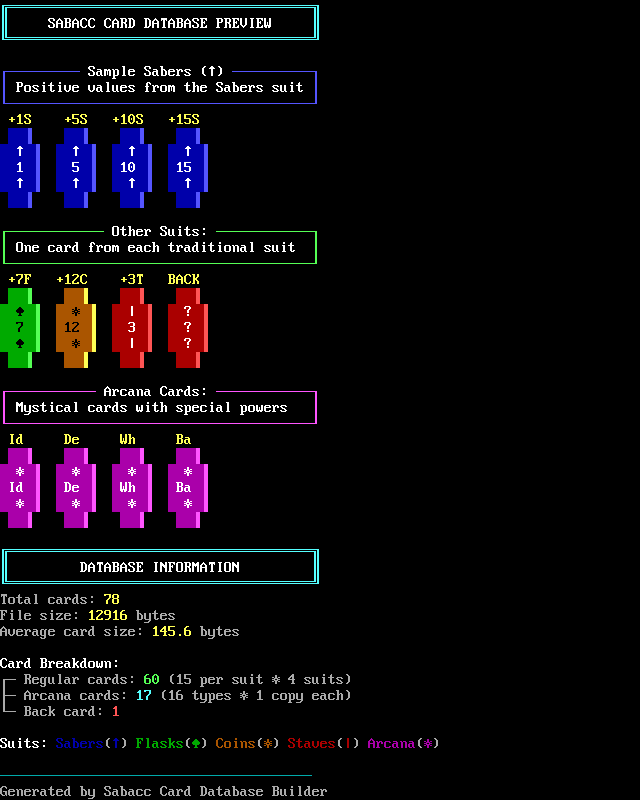

# ANSI Artist Design Brief - BBS Sabacc

## Project Overview

### Core Identity
**BBS Sabacc** is a terminal-based implementation of the classic Star Wars card game Sabacc, designed specifically for Linux-based Bulletin Board Systems (BBS). The game faithfully implements the 1989 West End Games Classic Sabacc ruleset while maintaining authentic BBS aesthetics and comprehensive CP437/ANSI character support.

### Aesthetic Vision
The visual design captures the Star Wars "lived-in" universe aesthetic—focusing on the gritty underworld of scoundrels, rogues, and gamblers in smoky cantina backrooms. This emphasizes character-driven storytelling (Han Solo, Lando Calrissian) over space battles and superweapons.

### Technical Scope
- **Primary Target**: CP437 (IBM PC Extended ASCII) character set compatibility
- **Extended Support**: Non-CP437 character sets (Amiga, Atari ST) via SyncTerm terminal emulation
- **Compatibility Goal**: Maximum BBS software platform support across diverse terminal types

## Specifications

### Display Requirements
- **Fixed Resolution**: 80x25 characters (standard BBS terminal size)
- **Character Set**: CP437 (IBM PC Extended ASCII) 
- **Terminal Type**: ANSI/ASCII compatible for maximum BBS compatibility
- **Color Support**: 16-color ANSI palette (standard BBS colors)
- **File Format**: `.ans` files (ANSI art format)

### Current Screen Layout (80x25)

Game UI showing AI players, central game log, and player area. I'm open to a re-design of the UI!

---

### Current Card Layout 

Example from card database. I'm open to a re-design of the cards as well.

---

## ANSI Art Files Requested

### Existing Files (in `/ansi/` directory)
1. **`title.ans`** - Main game title/logo
2. **`menu.ans`** - Main Menu (Play, Quit, etc.)
3. **`portraits.ans`** - External AI player portrait collection
4. **`sabacc.ans`** - Main Sabacc logo/branding
5. **`result-bomb.ans`** - "Bomb out" result screen (lose condition)
6. **`result-sabacc.ans`** - "Pure Sabacc" victory screen (win condition)
7. **`result-shift.ans`** - "Sabacc Shift" event screen (in-game event)

### Portrait System Details
- **4 AI Characters**: PHOOJA, ASH-TAAC, OOLANGA, KY'ALA
- **Portrait Dimensions**: 9 characters wide × 6 characters high
- **Border System**: 1-character border around portraits when active
- **Position**: Corner locations (top-left, top-right, bottom-left, bottom-right)

### Card Specifications
**Total Cards in 1989 Classic Sabacc Deck: 76 cards**
- **60 Numbered Cards**: Values 1-15 in each of 4 suits (Sabers, Flasks, Coins, Staves)
- **16 Arcana Cards**: Values -1 through -16 (Death, Strength, Moderation, Evil One, Justice, Queen of Air and Darkness, Endurance, Balance, Demise, Destruction, Despair, Failure, Futility, Mistress, Idiot, The Wheel) **plus** Star (-17)