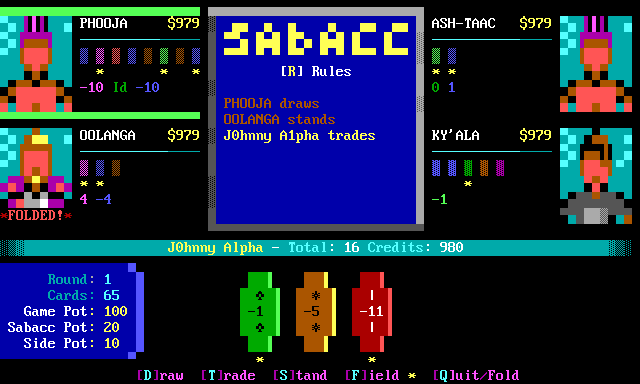

# 🎮 BBS Sabacc

> **"Never tell me the odds!"** - Classic Star Wars Sabacc card game for Bulletin Board Systems



[](https://golang.org/)
[](https://en.wikipedia.org/wiki/Bulletin_board_system)
[](LICENSE)
[](https://github.com/robbiew/bbs-sabacc)

## ✨ Features

- 🃏 **Authentic 1989 West End Games Rules** - The original Classic Sabacc experience
- 🎨 **ANSI Terminal Graphics** - Beautiful CP437 card art and UI
- 🤖 **Smart AI Opponents** - 4 AI players with configurable personalities  
- 🏛️ **BBS Integration** - Full door32.sys support for all major BBS systems
- ⚡ **Sabacc Shifts** - Unpredictable card reshuffling adds excitement
- 🛡️ **Static Field** - Protect your cards from Sabacc Shifts
- 📊 **Statistics Tracking** - Win/loss records and achievements

## 🚀 Quick Start

### Prerequisites
- Linux-based BBS system (Mystic, Synchronet, Talisman, ENiGMA½, WWIV)
- Go 1.19+ (for building from source)
- ANSI terminal support

### Installation

```bash
# Clone and build
git clone https://github.com/robbiew/bbs-sabacc.git
cd bbs-sabacc

# Generate card database (required)
go run cmd/build-cards/main.go

# Build the game
go build -ldflags="-s -w" -o sabacc .
```

### BBS Configuration

```bash
# Run as BBS door game
./sabacc -path /path/to/drop_file_dir/
```

## 🎯 Game Rules

**Objective**: Get exactly **23 points** (Pure Sabacc) or the highest total ≤ 23

- **76-card deck**: 60 numbered cards + 16 Arcana cards
- **Bomb conditions**: >23, <-23, or exactly 0 points
- **Special hands**: Pure Sabacc (23), Idiot's Array (Idiot+2+3)
- **Sabacc Shifts**: Cards can be reshuffled randomly during play

## 📁 Directory Structure

```
/path/to/doors/sabacc/
├── sabacc              # Main executable
├── sabacc_cards.bin    # Card graphics database
├── sabacc.conf         # Game configuration
└── ansi/
    └── portraits.ans   # AI player portraits
```

## ⚠️ Development Status

**🚧 Active Development** - Core gameplay is functional but under active improvement:

- ✅ Complete Classic Sabacc rule implementation
- ✅ BBS integration with door32.sys support
- ✅ Smart AI opponents with strategic decision-making
- 🔄 UI polish and layout improvements in progress
- 🔄 Enhanced features and statistics system planned

## 🤝 Contributing

This project welcomes contributions! See [`memory-bank/README.md`](memory-bank/README.md) for detailed development context and architecture documentation.

**Priority Issues:**
- Game loop continuity (currently ends after 1 round)
- AI portrait randomization improvements
- UI layout consistency enhancements

## 📚 Documentation

- **[Memory Bank](memory-bank/README.md)** - Complete development documentation
- **[Architecture Overview](memory-bank/architectureOverview.md)** - System design and diagrams
- **[Known Issues](memory-bank/knownIssues.md)** - Current bugs and technical debt
- **[Development Roadmap](memory-bank/developmentRoadmap.md)** - Future plans and priorities

## ⚖️ Game Configuration

The game auto-generates `sabacc.conf` with customizable settings:
- Starting credits and betting limits
- AI personality types (conservative, balanced, aggressive)  
- Sabacc Shift probability
- Idle timeout values

## 🎮 BBS Systems Supported

- **Mystic BBS** - Full compatibility
- **Synchronet** - Full compatibility  
- **Talisman** - Full compatibility
- **ENiGMA½** - Full compatibility
- **WWIV** - Full compatibility

---

<div align="center">

**🌟 Experience the galaxy's most notorious card game! 🌟**

*Step into the cantina and test your luck against the galaxy's craftiest players...*

</div>
