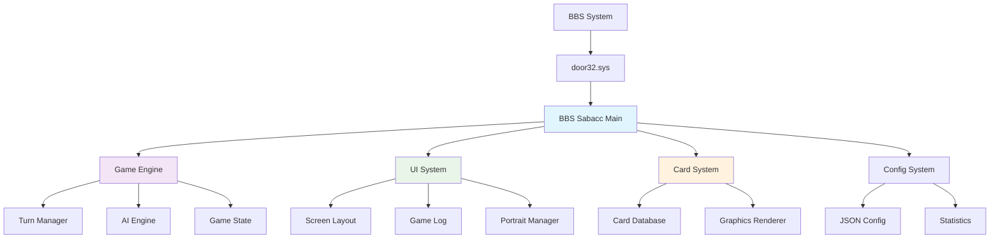
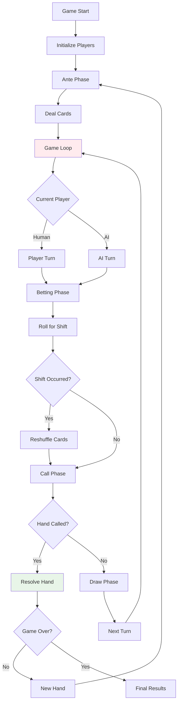
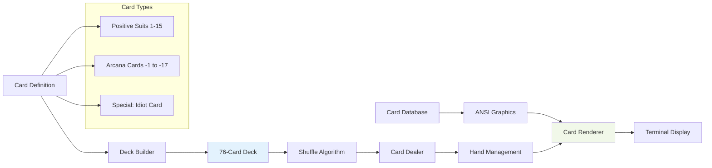
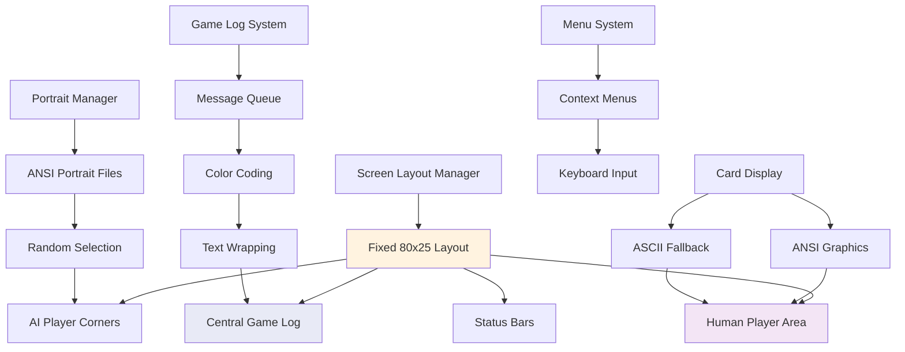
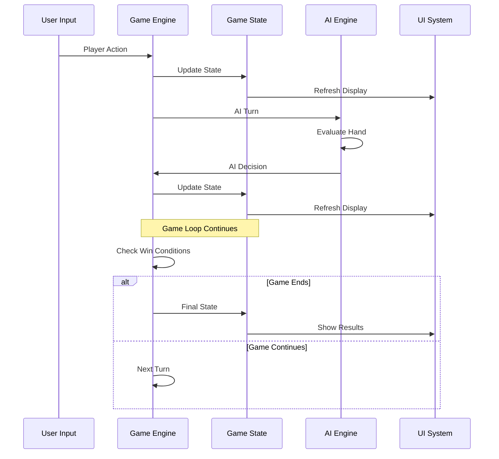
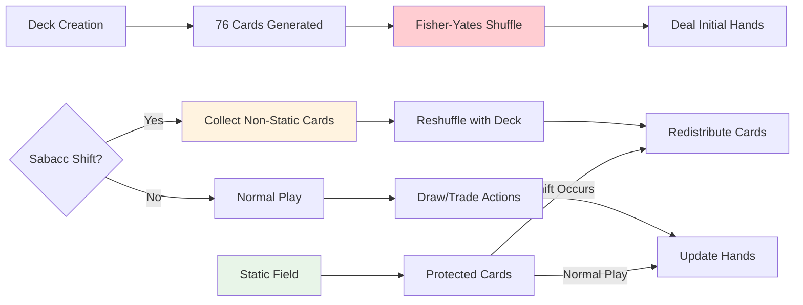
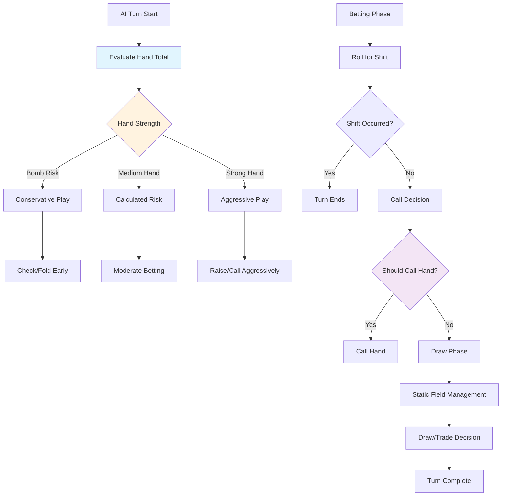
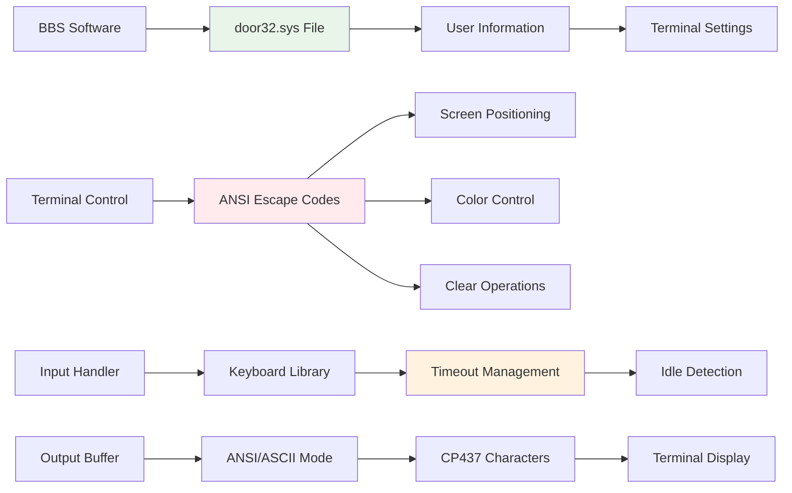
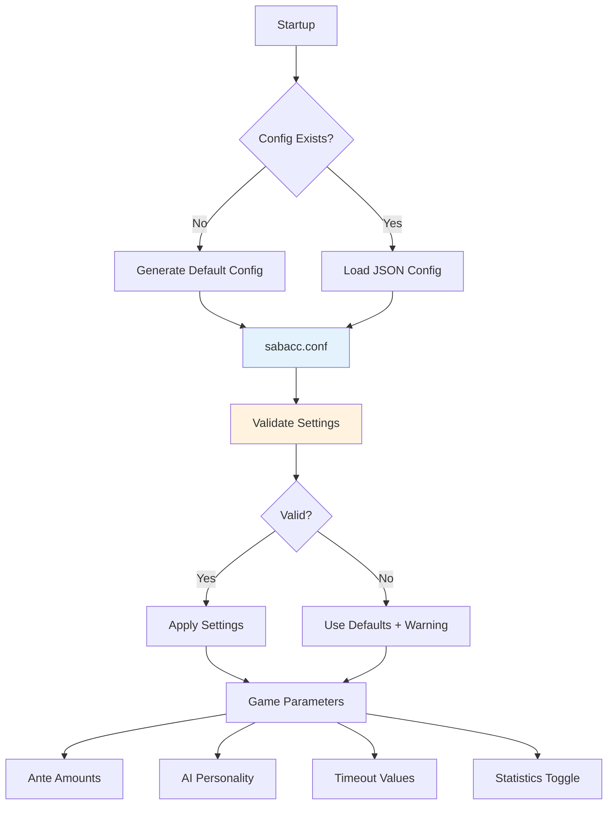
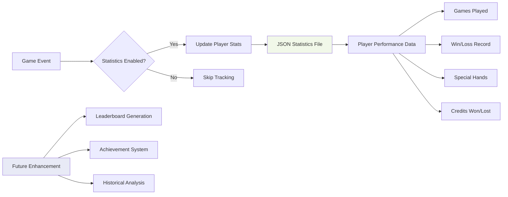

# BBS Sabacc - System Architecture Overview

## High-Level Architecture

BBS Sabacc follows a modular, event-driven architecture optimized for terminal-based BBS environments. The system is designed with clear separation of concerns and robust error handling.

## Core Module Architecture

### 1. Game Engine (`main.go`)
**Responsibility**: Core game logic, turn management, game state coordination

### 2. Card System (`cards.go`)
**Responsibility**: Deck management, card graphics, rendering system

### 3. UI System (`ui.go`)
**Responsibility**: Screen management, layout, user interface components

## Data Flow Architecture

### Game State Management

### Card Management Flow

## AI Decision Architecture

### AI Decision Tree

## BBS Integration Layer

### Terminal Communication

## Configuration & Data Management

### Configuration System

### Statistics Tracking

## Performance Considerations

### Memory Management
- **Card Graphics**: Binary database minimizes memory footprint
- **Game State**: Efficient struct design for BBS resource constraints  
- **Portrait Cache**: On-demand loading with graceful fallbacks
- **String Operations**: Optimized ANSI code handling

### Network Optimization
- **Terminal Updates**: Targeted screen refreshes minimize bandwidth
- **Input Buffering**: Efficient keyboard handling with timeouts
- **Error Recovery**: Graceful degradation for connection issues

### BBS Compatibility
- **Resource Limits**: Designed for shared system environments
- **Process Isolation**: Clean startup/shutdown for BBS integration
- **File Locking**: Safe concurrent access for multi-node systems

---

## Security Architecture

### Input Validation
- **door32.sys Parsing**: Robust file format validation
- **User Input**: Keyboard input sanitization and bounds checking
- **Configuration**: JSON parsing with type safety

### File System Security  
- **Relative Paths**: All file operations use relative paths
- **Permission Handling**: Appropriate file permissions for BBS environments
- **Error Containment**: Graceful handling of file system errors

---

*Architecture documented: 2025-08-14*  
*System design optimized for BBS terminal environments*